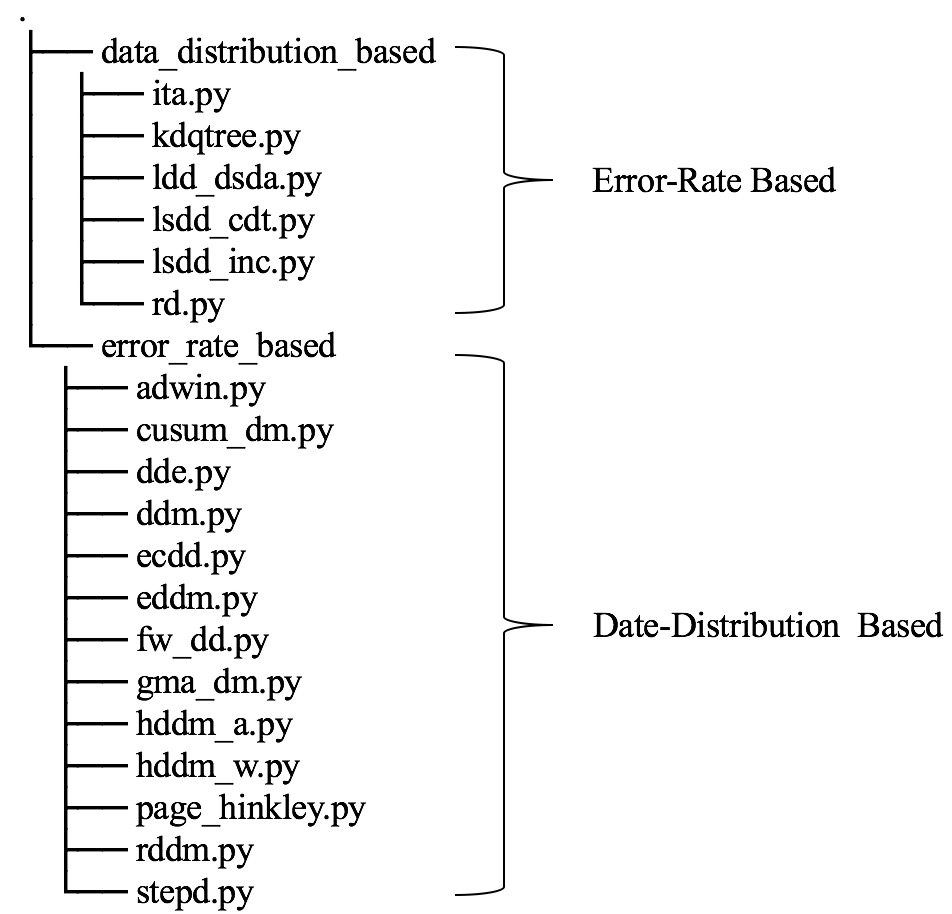
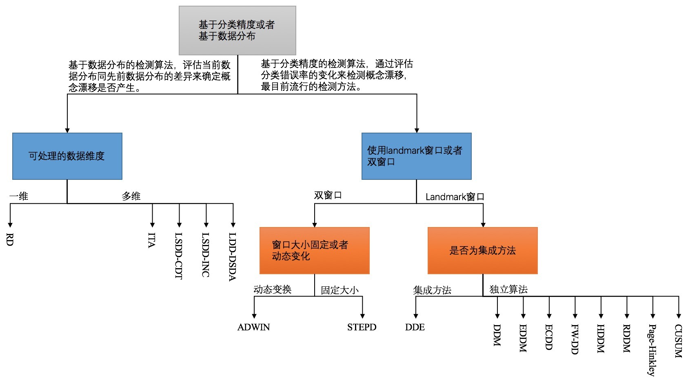
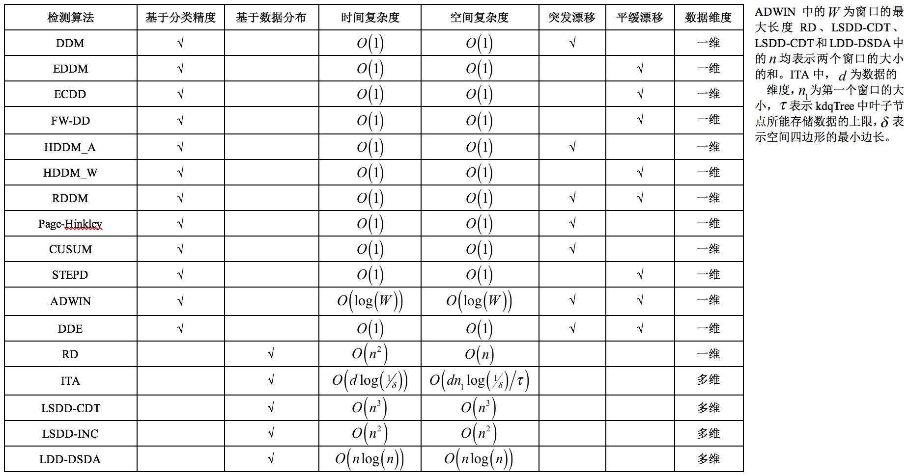

LIBCDD
==========

##### A Library of Concept Drift Detection Method



## Introduction

**LIBCDD** is a python-based library of Concept Drift Detection Method, which includes:

+ Drift Detection Method (DDM)[10]
+ Early Drift Detection Method (EDDM)[11]
+ EWMA for Concept Drift Detection (ECDD)[12]
+ Fuzzy Windowing Drift Detection Method (FW-DDM)[13]
+ Heoffding’s inequality based Drift Detection Method A Test (HDDM_A)[14]
+ Heoffding’s inequality based Drift Detection Method W Test (HDDM_W)[14]
+ Reactive Drift Detection Method (RDDM)[15]
+ Page-Hinkley[16]
+ CUSUM[16]
+ Statistical Test of Equal Proportions Detection (STEPD)[17]
+ ADaptive WINdowing (ADWIN)[18]
+ Drift Detection Ensemble (DDE)[19]
+ Relativized Discrepancy (RD)[2]
+ Information-Theoretic Approach (ITA)[22]
+ Least Squares Density Difference-based Change Detection Test (LSDD-CDT)[23]
+ LSDD-INC[24]
+ Local Drift Degree-based Density Synchronized Drift Adaptation(LDD-DSDA)[25]

Our goal is to facilitate the use of the popular concept drift detection methods. **LIBCDD** provides a simple python interface where users can easily apply an appropriate concept drift detection method to their data. The taxonomy of these methods and characteristics of the concept drift detection methods are listed as follows:





## Requirement

+ scipy==1.0.0
+ numpy==1.13.3+mkl
+ matplotlib==2.1.1
+ scikit_learn==0.19.1
+ scikit_multiflow==0.4.1

## Download LIBCDD

The current release (Version 1.0, May 2020)  of **LIBCDD** can be obtained by directly cloning this repository.


## Quick Start

Below is the example code to call a concept drift detection method.

```python
import numpy as np
from libcdd.error_rate_based import *
#新建一个检测器
detector = DDM()
#获取2000个数据，其中前后1000个数据分别服从不同的正态分布
#以0为决策边界
np.random.seed(1)
mu, std = 0, 0.1      # 均值和标准差
data1 = np.random.normal(mu, std, 1000) > 0
data1 = data1.astype(int)
mu, std = 0.5, 0.1
data2 = np.random.normal(mu, std, 1000) > 0
data2 = data2.astype(int)
data_stream = np.concatenate((data1, data2))
#检测过程
detected_indices = []
for i in range(data_stream.size):
    detector.add_element(data_stream[i])
    if detector.detected_change():
        print(str(i)+"时刻发生了概念漂移")
#程序的运行结果为：1049时刻发生了概念漂移
```

## References

[1]G. Widmer, M. Kubat. Learning in the presence of concept drift and hidden contexts[J]. Machine learning, 1996, 23(1): 69-101.

[2]D. Kifer, S. Ben-David, J. Gehrke. Detecting change in data streams[A]. In: Proceedings of the VLDB[C], 2004, pp. 180-191.

[3]G. Hulten, L. Spencer, P. Domingos. Mining time-changing data streams[A]. In: Proceedings of the seventh ACM SIGKDD international conference on Knowledge discovery and data mining[C], 2001, pp. 97-106.

[4]J.C. Schlimmer, R.H. Granger. Incremental learning from noisy data[J]. Machine learning, 1986, 1(3): 317-354.

[5]J. Lu, A. Liu, F. Dong, et al. Learning under concept drift: A review[J]. IEEE Transactions on Knowledge Data Engineering, 2018, 31(12): 2346-2363.

[6]J. Gama, I. Žliobaitė, A. Bifet, et al. A survey on concept drift adaptation[J]. ACM computing surveys, 2014, 46(4): 1-37.

[7]M. Basseville, I.V. Nikiforov, Detection of abrupt changes: theory and application (1st Edition)[M], prentice Hall Englewood Cliffs, 1993.

[8]A. Bifet, G. Holmes, R. Kirkby, et al. Moa: Massive online analysis[J]. Journal of Machine Learning Research, 2010, 11(May): 1601-1604.

[9]J. Montiel, J. Read, A. Bifet, et al. Scikit-multiflow: A multi-output streaming framework[J]. 2018, 19(1): 2915-2914.

[10]J. Gama, P. Medas, G. Castillo, et al. Learning with drift detection[A]. In: Proceedings of the Brazilian symposium on artificial intelligence[C], 2004, pp. 286-295.

[11]M. Baena-Garcıa, J. del Campo-Ávila, R. Fidalgo, et al. Early drift detection method[A]. In: Proceedings of the Fourth international workshop on knowledge discovery from data streams[C], 2006, pp. 77-86.

[12]G.J. Ross, N.M. Adams, D.K. Tasoulis, et al. Exponentially weighted moving average charts for detecting concept drift[J]. Pattern recognition letters, 2012, 33(2): 191-198.

[13]A. Liu, G. Zhang, J. Lu. Fuzzy time windowing for gradual concept drift adaptation[A]. In: Proceedings of the 2017 IEEE International Conference on Fuzzy Systems (FUZZ-IEEE)[C], 2017, pp. 1-6.

[14]I. Frías-Blanco, J. del Campo-Ávila, G. Ramos-Jimenez, et al. Online and non-parametric drift detection methods based on Hoeffding’s bounds[J]. IEEE Transactions on Knowledge Data Engineering, 2014, 27(3): 810-823.

[15]R.S. Barros, D.R. Cabral, P.M. Gonçalves Jr, et al. RDDM: Reactive drift detection method[J]. Expert Systems with Applications, 2017, 90(344-355.

[16]E.S. Page. Continuous inspection schemes[J]. Biometrika, 1954, 41(1/2): 100-115.

[17]K. Nishida, K. Yamauchi. Detecting concept drift using statistical testing[A]. In: Proceedings of the International conference on discovery science[C], 2007, pp. 264-269.

[18]A. Bifet, R. Gavalda. Learning from time-changing data with adaptive windowing[A]. In: Proceedings of the 2007 SIAM international conference on data mining[C], 2007, pp. 443-448.

[19]B.I.F. Maciel, S.G.T.C. Santos, R.S.M. Barros. A lightweight concept drift detection ensemble[A]. In: Proceedings of the 2015 IEEE 27th International Conference on Tools with Artificial Intelligence (ICTAI)[C], 2015, pp. 1061-1068.

[20]T. Hagerup, C. Rüb. A guided tour of Chernoff bounds[J]. Information processing letters, 1990, 33(6): 305-308.

[21]V.N. Vapnik. An overview of statistical learning theory[J]. IEEE transactions on neural networks, 1999, 10(5): 988-999.

[22]T. Dasu, S. Krishnan, S. Venkatasubramanian, et al. An information-theoretic approach to detecting changes in multi-dimensional data streams[A]. In: Proceedings of the In Proc. Symp. on the Interface of Statistics, Computing Science, and Applications[C], 2006, pp. 1-24.

[23]L. Bu, C. Alippi, D. Zhao. A pdf-free change detection test based on density difference estimation[J]. IEEE transactions on neural networks learning systems, 2016, 29(2): 324-334.

[24]L. Bu, D. Zhao, C. Alippi. An incremental change detection test based on density difference estimation[J]. IEEE Transactions on Systems, Man, Cybernetics: Systems, 2017, 47(10): 2714-2726.

[25]A. Liu, Y. Song, G. Zhang, et al. Regional concept drift detection and density synchronized drift adaptation[A]. In: Proceedings of the IJCAI International Joint Conference on Artificial Intelligence[C], 2017, pp. 2280–2286.

